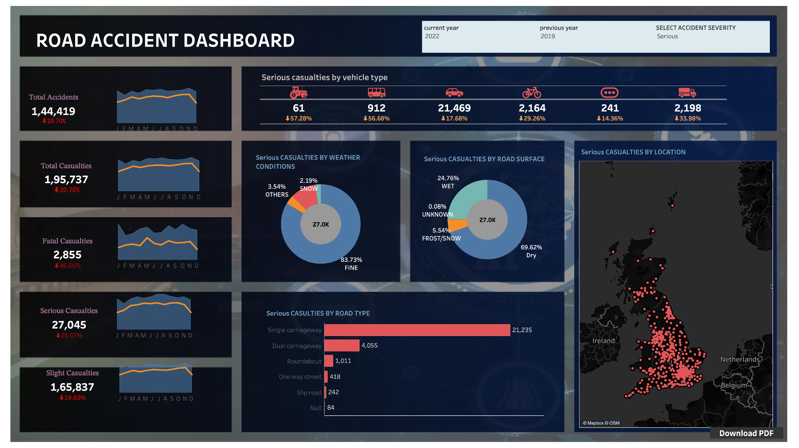

# 🚗 Road Accident Analysis Dashboard

## 📊 Overview

The **Road Accident Analysis Dashboard** is an interactive visualization tool built using Tableau Desktop. It provides in-depth insights into road accident data, helping users to understand accident trends, casualty rates, and the impact of various factors like weather, road type, and vehicle type.

## 📁 Project Details

### 📂 Data Source
- **Dataset:** [Accident Data](https://www.kaggle.com) (CSV file) from Kaggle.
- **File Used:** `accident_data.csv`

### 🔍 Dashboard Features
The dashboard offers the following key features:

1. **Total Accidents:** Overall number of accidents recorded.
2. **Total Casualties:** Number of casualties, further detailed into:
   - **Fatal Casualties**
   - **Serious Casualties**
   - **Slight Casualties**
3. **Sparklines:** Monthly trend visualization (January to December).
4. **Parameters:**
   - **Current Year:** Displays data for the selected current year.
   - **Previous Year:** Allows comparison with the previous year.
   - **Select Accident Type:** Filters accidents based on severity (e.g., Fatal, Serious).

5. **Casualties Breakdown:**
   - **By Vehicle Type:** Analysis of casualties categorized by the type of vehicle involved.
   - **By Road Surface:** Casualties categorized by road surface conditions.
   - **By Road Type:** Casualties categorized by the type of road where the accident occurred.
   - **By Weather Conditions:** Analysis of how weather conditions influenced accidents.
   - **By Location:** Geographic distribution of accidents.

## 🛠️ Installation

### 🧰 Requirements
- **Tableau Desktop:** Ensure Tableau Desktop is installed on your machine.

### 📥 Instructions
1. **Clone or download** the repository containing the Tableau workbook and `accident_data.csv`.
2. **Open** the Tableau workbook file (`.twb` or `.twbx`) in Tableau Desktop.
3. The data source should automatically connect to `accident_data.csv`. If it doesn’t, manually link the data source to the file.
4. **Explore** and interact with the dashboard to gain insights.

## 💼 Usage

This dashboard is intended for road safety analysts, policymakers, and researchers. Users can:
- Filter data by year, accident type, and other factors.
- Compare current and previous years' data.
- Drill down into specific metrics, such as casualties by vehicle type or road conditions.

## 📂 Repository Structure

- **/data/**
  - `accident_data.csv`: The dataset used for this analysis.
- **/dashboard/**
  - `road_accident_analysis_dashboard.twbx`: The Tableau workbook containing the dashboard.
  - `dashboard.png`: A snapshot of the Tableau dashboard.

## 📜 License

This project is licensed under the MIT License. See the [LICENSE](LICENSE) file for details.

## 🙏 Acknowledgments

- **Data Source:** The dataset used in this analysis was sourced from [Kaggle](https://www.kaggle.com).
